# MyPaintBoard

该应用为本人毕业设计多人实时画板。  

## 应用介绍
这是一个实时的多人同时绘画系统。  
该系统以房间为基本单位，每个房间中有多名用户，与一名管理员。  
房间用户可以一起聊天，也可以在画板上同时进行绘制，每个成员绘制的图像都会经由服务器同步到别的客户端上。  
管理员可以更改画板的背景，亦可以选择清空屏幕。  

## 界面截图
登录注册：  
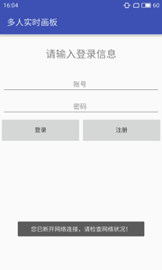 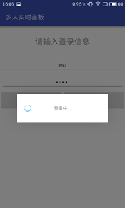 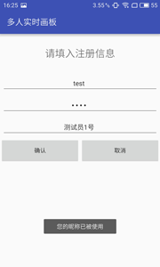

房间列表：  
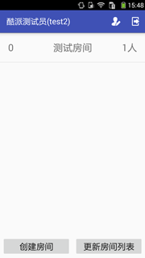

房间界面：  
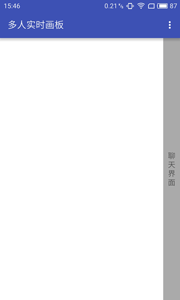 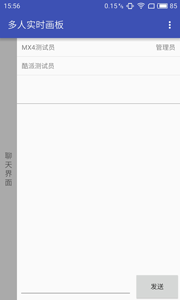 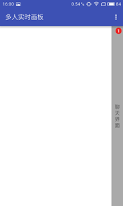 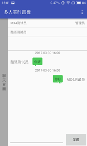

房间绘制：  
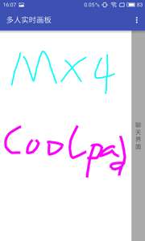 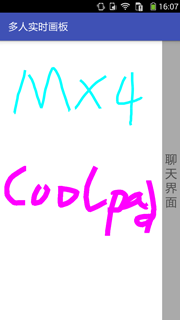

上传背景：  
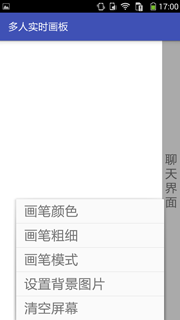 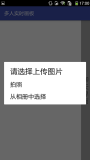 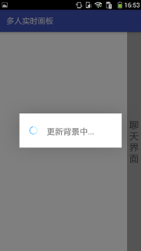  
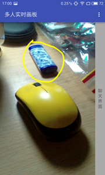 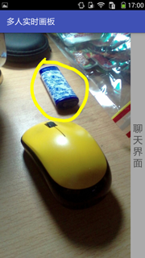

## 下载地址
https://github.com/superxlcr/MyPaintBoard/blob/master/app/build/outputs/apk/app-debug.apk